# CimPDC -> Strapi PDC

## ProductenCatalogus
De producten catalogus staat als collectie type in strapi:
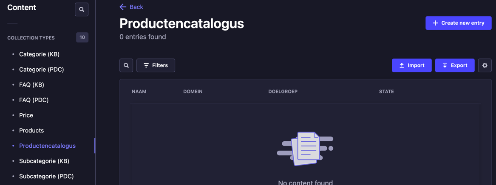

### Organisatie-identificatie
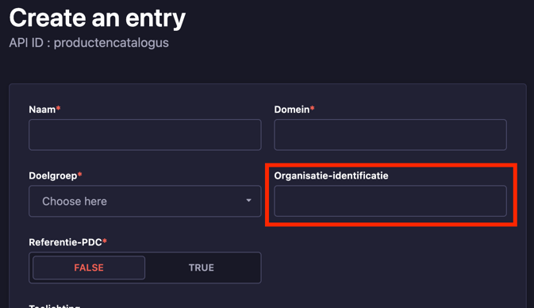

### Domein
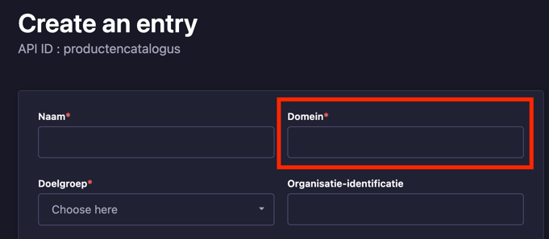

### Naam
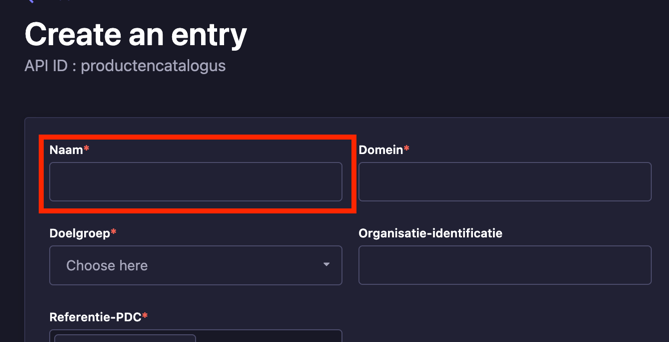

### Doelgroep
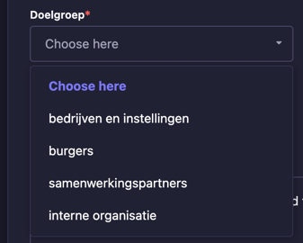

### Referentie-PDC
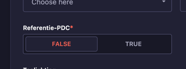

### Toelichting
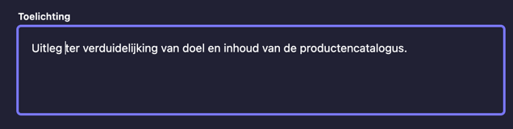

### Versie
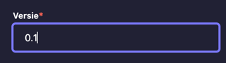

### Begindatum versie
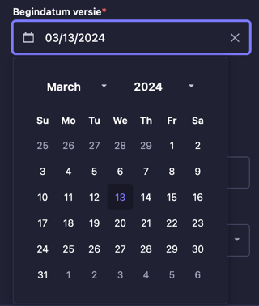

### Beherende organisatie

### Contactpersoon beheer naam
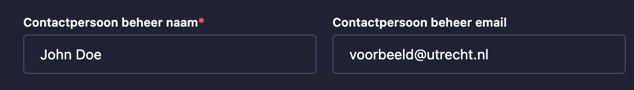

### Contactpersoon beheer email

### Relaties

#### ProductenCatalogus [0 .. * ] ProductenCatalogus
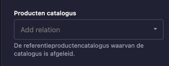

#### ProductType [ 1 .. * ] ProductenCatalogus
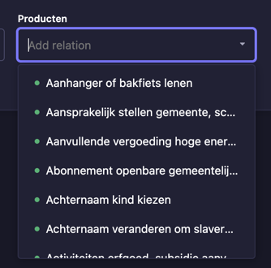

## ProductType
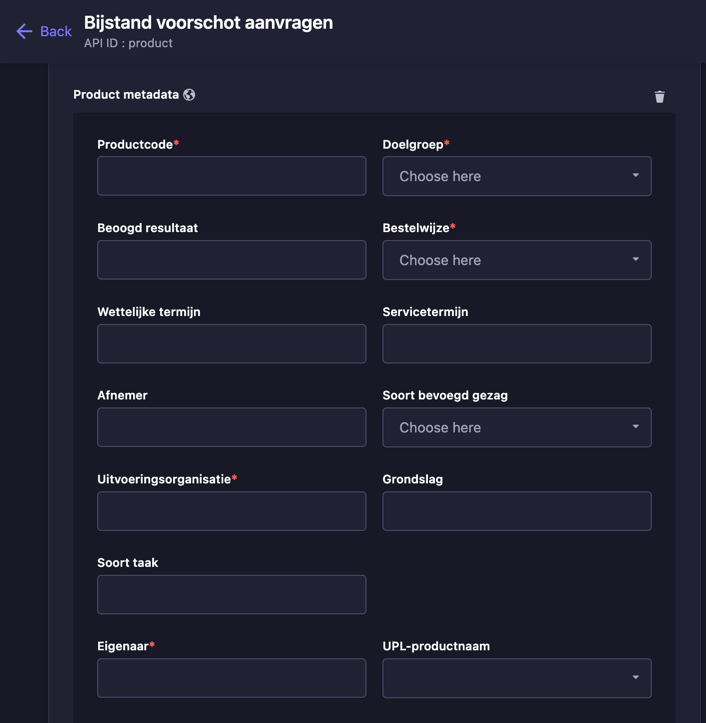

### Productcode

### Doelgroep
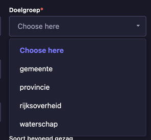

### Beoogd resultaat

### Bestelwijze
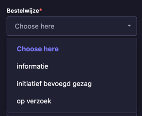

### Wettelijke termijn

### Servicetermijn
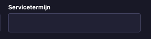

### Afnemer
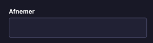

### Soort bevoegd gezag
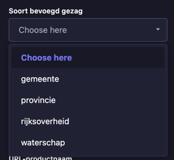

### Uitvoeringsorganisatie
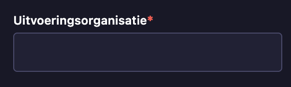

### Grondslag
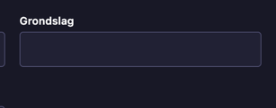

### Soort taak

### UPL-Productnaam
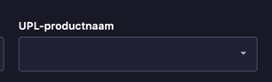

### Eigenaar
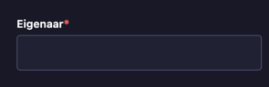

### Taalafhankelijke productbeschrijving
#### 1. Klik op "Add a component to sections"
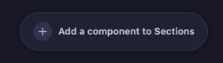
#### 2. Kies "Contentblok"
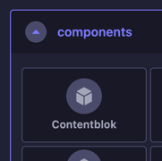
#### 3. Zorg ervoor dat je een Kennisartikel categorie aangeeft
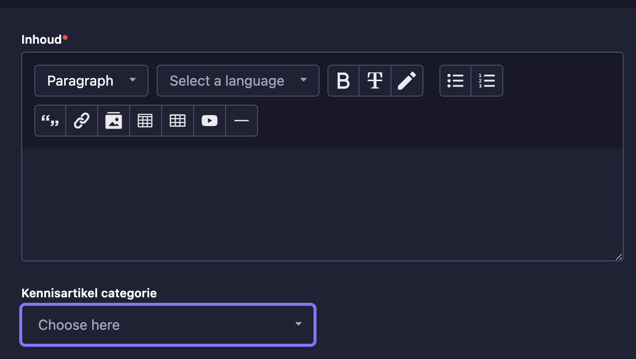
